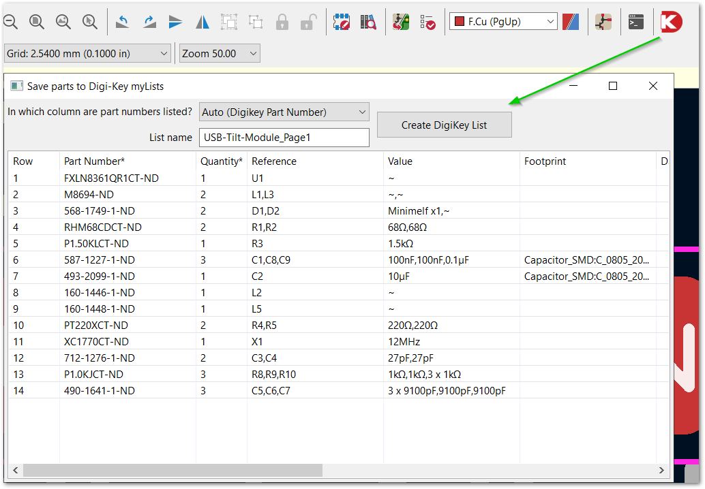
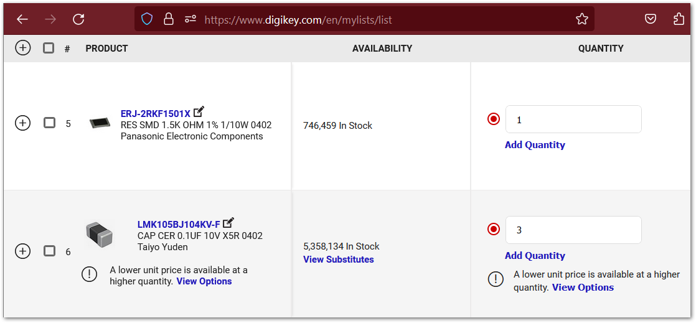

# KiCad addon: Push parts to Digi-Key myLists

This addon helps you collect parts in your [KiCad](https://www.kicad.org/) schematic file and push them to Digi-Key [myLists](https://www.digikey.com/en/mylists/).

> With myLists, you can calculate assemblies, find alternates, calculate attrition, and more.

## Installation

- Download the addon from [latest release](https://github.com/Digi-Key/KiCad-Push-to-DigiKey/releases/latest)
- Open KiCad, select KiCad Plugin and Content Manager, click `Install from File...`
- Select the downloaded .zip file in step 1, click `Open`

## Usage

- Open the `PCB Editor` (not Schematic Editor), click the `Push to Digi-Key myLists` icon on the toolbar
- In the dialog that opens, press the `Create DigiKey List` button
- Parts will be pushed to Digi-Key myLists





## Frequently Asked Questions

Q: The Part Numbers column does not seem right.

A: The addon tries to guess which column contains part numbers from the schematic file. 
If the `Auto` guess is not what you expect, you can choose a column for Part Number manually.


Q: Why do some columns end with an asterisk?

A: Part Number and Quantity columns are required to create a DigiKey myList. They are marked with an asterisk at the end.


Q: I don't find any part numbers after opening the addon.

A: Please make sure the schematic file does have some part numbers. Also try different columns for `Part Number`. 
If this persists, it's a bug. Please consider reporting bugs ([guide](https://docs.github.com/en/issues/tracking-your-work-with-issues/creating-an-issue)).
We appreciate your time and effort.


Q: Is Python required to use the addon?

A: Yes. But because Python is usually bundled into KiCad installation files, you probably don't need to install Python separately.


Q: Why do I need to open PCB Editor (instead of Schematic Editor) to get parts in the schematic?

A: For now, only the PCB Editor provides an interface (`pcbnew`) for plugin development.

source:
- https://dev-docs.kicad.org/en/python/
- https://forum.kicad.info/t/writing-and-publishing-a-plugin/38830


Q: Can I add some note to a part number?

A: Yes. The last column - `Note` - is editable. Scroll the addon window all the way to the right to see this column. Double-click a row to edit, press Enter when you finish. `Note` will be sent to Digi-Key myLists as well.


Q: What is `Customer Reference` column for?

A: It's for Digi-Key customer with a reference number. This column is not required, so you can leave it blank.


Q: May I reuse and modify the code?

A: Yes, you can reuse and modify the code under [MIT license](https://github.com/Digi-Key/KiCad-Push-to-DigiKey/blob/master/LICENSE.md).


Q: How to build the addon from the source code?

A: We have a [section](#building-addon-from-source-code) for building the addon from the source code.

## Building addon from source code
To build the addon from source code, a separate installation of Python on your machine is recommended.

1. Install [Python](https://www.python.org/downloads/) if you don't have it yet. Using a [virtual environment](https://docs.python.org/3/library/venv.html) is recommended.
2. Download the source code
3. Make changes (optional)
4. Run `build` command

### Download the source code

1. Go to the source code page on [https://github.com/Digi-Key/KiCad-Push-to-DigiKey](https://github.com/Digi-Key/KiCad-Push-to-DigiKey)
2. Click the `Code` button

You can download the source code via git clone, GitHub CLI, as zip file, and other methods.

### Run `build` command
Go to the root directory of the source code, the directory should contain `pcm` and `src` directories.

```bash
python pcm/build.py
```

A .zip file will be created in `build/` directory. Use this file to install the addon in KiCad Plugin and Content Manager.

Note: Running this command will erase and recreate the `build/` directory.